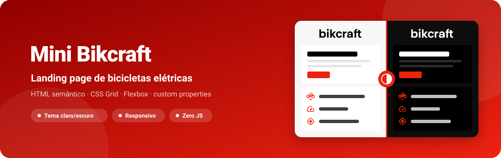
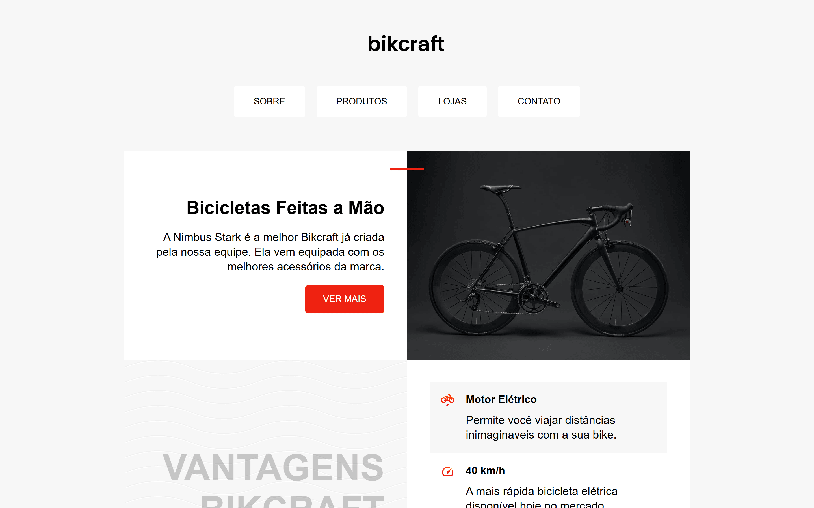
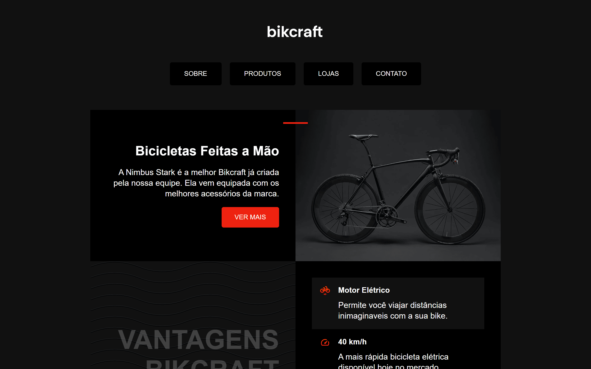
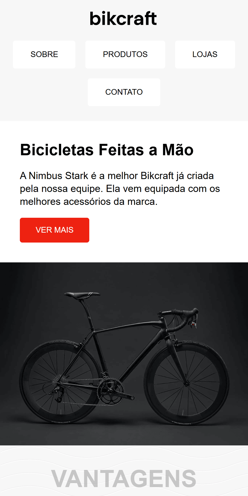
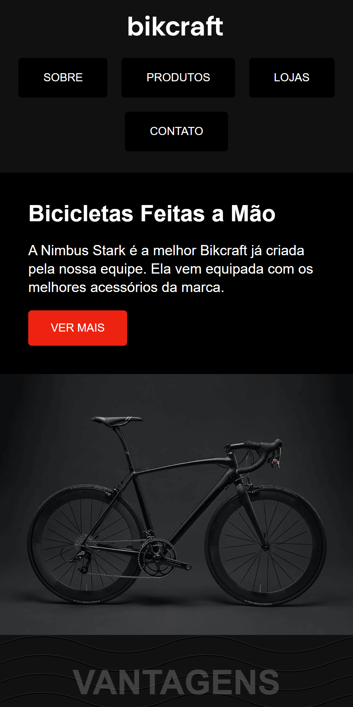

<div align="center">



**Landing page da Bikcraft em HTML semântico e CSS puro, com tema claro/escuro que segue o sistema.**

[](https://kessleru.github.io/Mini-Bikcraft-Web/)
[](https://github.com/kessleru/Mini-Bikcraft-Web/actions/workflows/pages/pages-build-deployment)
[](https://github.com/kessleru/Mini-Bikcraft-Web/commits/main)



</div>

## Sobre

Uma página de apresentação para a Bikcraft, marca fictícia de bicicletas elétricas feitas à mão:
chamada principal com foto do produto, seção de vantagens e rodapé. É um estudo de **layout com CSS
Grid** e de **tema por custom properties** — sem framework, sem build e sem nenhuma linha de
JavaScript.

O tema escuro não tem botão: um bloco `@media (prefers-color-scheme: dark)` redefine as variáveis de
cor e troca até a textura de ondas do fundo, então a página acompanha o tema do sistema de quem
visita.

## Telas

### Tema escuro



### Mobile

Abaixo de 600px o conteúdo vira coluna única e o texto da chamada passa a alinhar à esquerda.

<table>
<tr>
<td width="50%"></td>
<td width="50%"></td>
</tr>
<tr>
<td align="center"><sub><b>Tema claro</b></sub></td>
<td align="center"><sub><b>Tema escuro</b></sub></td>
</tr>
</table>

## Funcionalidades

| | |
|---|---|
| 🌗 **Tema automático** | `prefers-color-scheme` troca cores, fundos e a textura de ondas (`onda-clara.svg` / `onda-escura.svg`) |
| 📐 **Layout em Grid** | Chamada e foto lado a lado; vantagens com ícone em uma coluna e texto na outra |
| 📱 **Responsivo** | Breakpoints em 950px, 600px e 400px |
| ♿ **Semântica** | `header`, `nav`, `main`, `article` e `footer`, com `aria-label` e `aria-labelledby` |
| 🖱️ **Hover** | Itens de vantagem ganham uma borda na cor primária |

## Stack

| Camada | Ferramenta |
|---|---|
| Marcação | HTML5 semântico |
| Estilo | CSS3 — Grid, Flexbox, custom properties, media queries |
| Ícones | SVG |
| Deploy | [GitHub Pages](https://pages.github.com) |

### Paleta

| Token | Claro | Escuro |
|---|---|---|
| `--cor-primaria` | `#e21` | `#e21` |
| `--cor-primaria-escura` | `#900` | `#900` |
| `--fundo-1` | `#f7f7f7` | `#111111` |
| `--fundo-2` | `#ffffff` | `#000000` |
| `--texto` | `#000000` | `#ffffff` |

## Rodando localmente

```bash
git clone https://github.com/kessleru/Mini-Bikcraft-Web.git
cd Mini-Bikcraft-Web
python -m http.server 8000
```

Abra `http://localhost:8000`. Não há dependências nem build — abrir o `index.html` direto no
navegador também funciona.

## Estrutura

```
├── index.html      # a página inteira
├── style.css       # tokens de cor, tema escuro, grid e breakpoints
└── img/
    ├── bicicleta.jpg
    ├── bikcraft.svg
    ├── eletrica.svg · velocidade.svg · rastreador.svg   # ícones das vantagens
    └── onda-clara.svg · onda-escura.svg                 # textura de fundo por tema
```

<details>
<summary><b>Regerando as imagens deste README</b></summary>

O banner é gerado por script, e as telas são capturas reais da página em 2x:

```bash
node .github/readme/gerar.mjs                 # banner.svg

python -m http.server 8000                    # em outro terminal
npm i --no-save puppeteer-core sharp
node .github/readme/capturar.mjs              # desktop, mobile e tema escuro
```

</details>

---

<div align="center">
<sub>Feito por <a href="https://github.com/kessleru">Otávio Kessler Ustra</a></sub>
</div>
